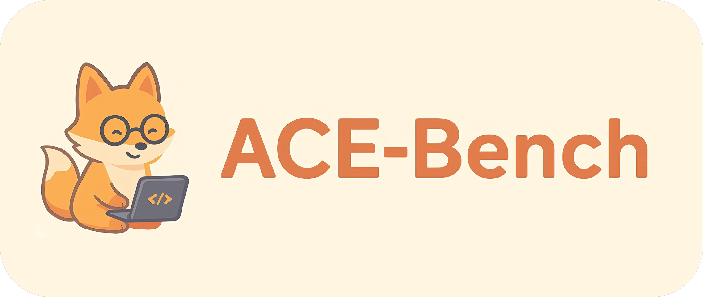
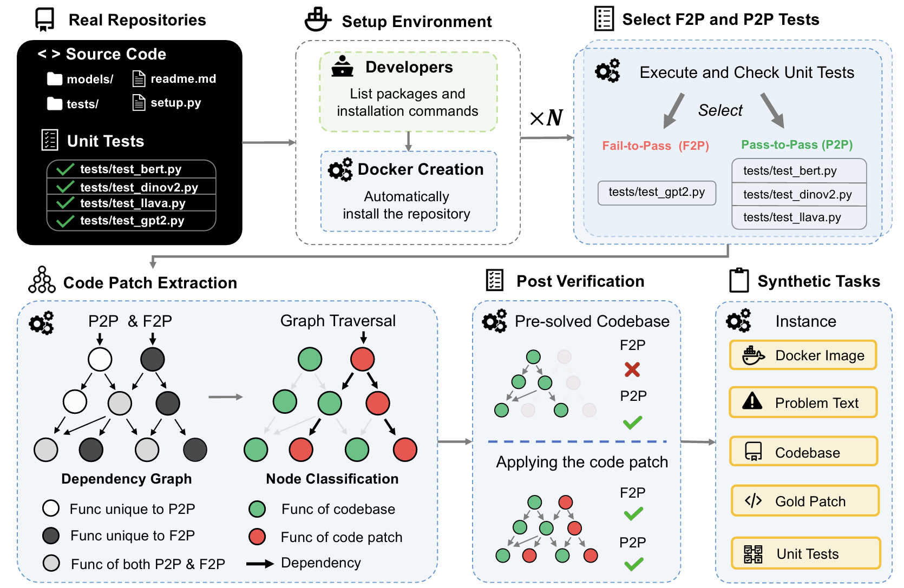

<p align="center">
  
</p>

<p align="center">
  <a href=""></a>
  <a href="LICENSE"></a>
  <a href="https://hub.docker.com/u/libercoders"></a>
  <a href="https://huggingface.co/datasets/LiberCoders/ACE-Bench"></a>
  <a href="https://LiberCoders.github.io/ACE-Bench/"></a>
</p>

---

# ACE-Bench: Benchmarking Agentic Coding in End-to-End Development of Complex Features

> ACE-Bench is a benchmark for evaluating agents on **end-to-end development of complex features**. It incorporates an execution-based evaluation protocol and a scalable **test-driven** method that automatically derives tasks from code repositories with minimal human effort.

<p align="center">
  
</p>

## 📰 News

🎁 **2026.01.18**: We now support one-click inference for mainstream agent frameworks, including OpenHands, Claude Code, Codex, and Gemini CLI. All supported agent frameworks can be found [here](acebench/infer/agents/). We have also open-sourced the ACE-Bench data pipeline.

## 🚀 Quickstart

### 0 Prerequisites

ACE-Bench uses [uv](https://github.com/astral-sh/uv) for environment management and [Docker](https://www.docker.com/) for reproducible evaluations. Please ensure both are installed before proceeding.

```bash
cd ACE-Bench
uv sync
```


### 1 Evaluation

Evaluate agent-generated patches against ACE-Bench test cases.

> Before running evaluation, we recommend pre-downloading the images to reduce network-related failures. Usage:
> ```
> source .venv/bin/activate
> python acebench/scripts/pull_images.py --mode full
> python acebench/scripts/pull_images.py --mode lite
> python acebench/scripts/pull_images.py --mode /path/to/images.txt
> ```

**Run evaluation**

```bash
source .venv/bin/activate

# Basic evaluation
python -m acebench.harness.run_evaluation \
    -p runs/2025-12-02__16-06-04/output.jsonl

# With custom options
python -m acebench.harness.run_evaluation \
    -p runs/2025-12-02__16-06-04/output.jsonl \
    --n-concurrent 4 \
    --gpu-ids "0,1,2,3" \
    --split "full" \
    --proxy-port 7890

# Evaluate specific instances
python -m acebench.harness.run_evaluation \
    -p runs/2025-12-02__16-06-04/output.jsonl \
    --task-id "repo__name.commit.test.hash.lv1"
```

**Command-line Arguments**

| Argument | Description | Default |
|----------|-------------|---------|
| `--predictions-path, -p` | Path to predictions JSONL file | Required |
| `--task-id` | Specific task IDs (instance IDs) to evaluate | All |
| `--n-concurrent` | Number of parallel workers | `4` |
| `--timeout` | Override test timeout (seconds) | From repo_settings |
| `--gpu-ids` | Comma-separated GPU IDs (e.g., `0,1,2,3`) | All available |
| `--proxy-port` | Proxy port for container network | None |
| `--review-codes` | Save agent code for review (`true`/`false`) | `false` |
| `--split` | Dataset split to load | `full` |

For more CLI arguments, see [here](docs/harness_cli_arg.md).

**Output Directory Structure**

```
runs/{timestamp}/
├── output.jsonl              # Inference results (input)
├── report.json               # Evaluation summary
└── eval_outputs/
    └── {instance_id}/
        └── attempt-{n}/
            ├── run_instance.log  # Evaluation log
            ├── test_output.txt   # Test execution output
            ├── patch.diff        # Applied patch
            └── report.json       # Instance evaluation result
```


### 2 Inference

Run agents on ACE-Bench tasks to generate patches.

> Before running Inference, we recommend pre-downloading the images to reduce network-related failures. Usage:
> ```
> source .venv/bin/activate
> python acebench/scripts/pull_images.py --mode full
> python acebench/scripts/pull_images.py --mode lite
> python acebench/scripts/pull_images.py --mode /path/to/images.txt
> ```

**Step 1: Configure agent credentials**

Copy `config_example.toml` to `config.toml` and fill in the required API keys:

For more details about `config.toml`, see [here](docs/config.md).

```toml
# For Claude Code agent
[infer_config.claude_code]
ANTHROPIC_API_KEY = "your-api-key"

# For OpenHands agent
[infer_config.openhands]
LLM_API_KEY = "your-api-key"  # Ensure the API key matches the provider of --model
```

**Step 2: Run inference**

```bash
source .venv/bin/activate

# Run with Claude Code agent on full set
python -m acebench.infer.run_infer \
    --agent claude_code \
    --model claude-sonnet-4-20250514 \
    --n-concurrent 4 \
    --split "full" \
    --n-attempts 1

# Run with specific tasks
python -m acebench.infer.run_infer \
    --agent openhands \
    --model openai/qwen3-coder-480b-a35b-instruct \
    --task-id "repo__name.commit.test.hash.lv1" \
    --level 1
```

**Step 3: Resume interrupted runs**

```bash
# Resume from a previous run directory
python -m acebench.infer.run_infer --resume runs/2025-12-02__16-06-04

# Resume with different concurrency, proxy-port, timeout, and gpu-ids (other args will be ignored)
python -m acebench.infer.run_infer \
    --resume runs/2025-12-02__16-06-04 \
    --n-concurrent 4 \
    --proxy-port 7890 \
    --timeout 7200 \
    --gpu-ids "0,1"
```

**Command-line Arguments**

| Argument | Description | Default |
|----------|-------------|---------|
| `--agent, -a` | Agent to use (`claude_code`, `openhands`) | Required |
| `--model, -m` | Model name (e.g., `claude-sonnet-4-20250514`) | Required |
| `--n-concurrent` | Number of concurrent tasks | `1` |
| `--n-attempts` | Number of attempts per task | `1` |
| `--task-id, -t` | Specific task IDs to process | All tasks |
| `--level` | Task levels to process (`1`, `2`) | `1` and `2` |
| `--split` | Dataset split to load | `full` |
| `--output-dir, -o` | Output directory | `runs` |
| `--timeout` | Timeout per task in seconds | `3600` |
| `--proxy-port` | Proxy port for container network | None |
| `--gpu-ids` | Comma-separated GPU IDs (e.g., `0,1,2,3`) | All available |
| `--resume` | Resume from previous run directory | None |

For more CLI arguments, see [here](docs/infer_cli_arg.md).

**Output Directory Structure**

```
runs/{timestamp}/
├── output.jsonl                  # Inference results (one JSON per line)
├── run_metadata.json             # Run configuration and metadata
├── run_summary_{timestamp}.json  # Run summary of success and failure
└── run_outputs/ 
    └── {task_id}/
        └── attempt-{n}/
            ├── infer.log         # Agent execution log
            ├── run.log           # Runtime log
            └── patch.diff        # Generated patch
```

**Step 4: Summarize results**

Summarize `eval_outputs` and generate a CSV report.

```bash
python acebench/scripts/cal_eval_outputs.py --path <eval_outputs_dir> --attempt-mode <attempt_mode>
```

`<attempt_mode>` can be `best`, `worst`, or a number (e.g., `1`, `2`, `3`). Default: `best`.

When `<attempt_mode>` is a number `k` and `--merge` is enabled, attempts 1..k are merged:
- pass_rate: average over the first k attempts
- resolved: pass@k style (success if any of the first k succeeds)
- prompt_tokens/completion_tokens: sum over the first k, then take the mean


### 3 Data Pipeline (Dataset Generation)

To generate new benchmark tasks from code repositories:

**Step 1: Configuration**

Copy `config_example.toml` to `config.toml` and fill in the "Global Environment Variables" and "DataPipeline Configuration" sections.

For more details about `config.toml`, see [here](docs/config.md).

Copy `acebench/resources/constants/python_example.py` to `<your_specs_file>.py` and complete the configuration.

**Step 2: Run the pipeline**

```bash
source .venv/bin/activate

python -m acebench.pipeline \
    --config-path acebench/resources/constants/python.py \
    --global-config-path config.toml \
    --output-dir outputs \
    --seed 42 \
    --debug-repo SPECS_LIGER_KERNEL
```

**Command-line Arguments**

| Argument | Description | Example |
|----------|-------------|---------|
| `--config-path` | Path to the repository specs configuration file | See `acebench/resources/constants/python_example.py` |
| `--global-config-path` | Path to the global configuration file (e.g., LLM settings) | See `config_example.toml` |
| `--output-dir` | Directory for output files | `--output-dir outputs` |
| `--seed` | Random seed for reproducibility | `--seed 42` |
| `--debug-repo` | (Optional) Specs configuration name defined in `--config-path` | `--debug-repo SPECS_LIGER_KERNEL SPECS_LITGPT` |
| `--debug-sample` | (Optional) Test file name (without `.py` suffix) | `--debug-sample test_config test_modeling` |
| `--resume` | (Optional) Resume from a previous run's timestamp directory | `--resume 2025-11-30/12-00-00` |

**Output Directory Structure**

```
outputs/{timestamp}/
├── cases/
│   └── {owner}__{repo}.{commit}/
│       └── {test}.{hash}.lv{1,2}/
│           ├── config.yaml
│           ├── instance.json
│           ├── patch.diff
│           ├── problem_statement.md
│           └── test_patch.diff
├── debug_outputs/
├── logs/
└── metadata_outputs/                   # Intermediate metadata and caches
    ├── classification/                 # Classification results
    ├── dynamic_trace/                  # Dynamic tracing data
    ├── llm_docstring/                  # LLM-generated docstrings
    ├── llm_task_statement/             # LLM-generated task statements
    ├── masked_files/                   # Masked source files
    ├── data_status.json                # Data processing status
    ├── files_status.json               # File processing status
    └── metadata.json                   # Run metadata
```

For more details about running the pipeline, please refer to [Pipeline Documentation](docs/pipeline.md).


## 📧 Contact

If you have any questions, feel free to contact [qixingzhou1125@gmail.com](mailto:qixingzhou1125@gmail.com) or [zjcheng2022@gmail.com](mailto:zjcheng2022@gmail.com).


## ✍️ Citation

If you found ACE-Bench useful, please cite us as:

```bibtex
xxx
```
